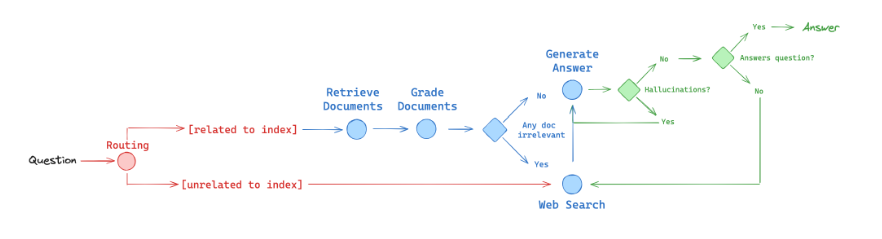

# Agentic RAG System with LangGraph, FastAPI, and Chainlit

Retrieval-Augmented Generation (RAG) system built with LangGraph for workflow orchestration, FastAPI for the backend API, and Chainlit for the user interface. The system leverages an agentic approach with self-correction capabilities to provide accurate answers based on a document index, falling back to web search when necessary.

## Workflow Overview

The core logic is implemented as a LangGraph state machine. The diagram below illustrates the flow:



The workflow proceeds as follows:

1.  **Question Routing:** The system first determines if the user's question is likely answerable by the indexed documents (vectorstore) or requires a web search.
2.  **Vectorstore Path:**
    *   **Retrieve Documents:** Relevant documents are fetched from the vector store.
    *   **Grade Documents:** Retrieved documents are assessed for relevance to the question. Irrelevant documents are filtered out.
    *   **Decision Point:** If relevant documents remain, proceed to generation. If documents were filtered out as irrelevant, trigger a web search to supplement information.
3.  **Web Search Path:** If routing initially decided web search, or if document grading indicated a need, perform a web search using the Tavily API.
4.  **Generate Answer:** An LLM (GPT-4.1-mini) generates an answer based on the retrieved documents and/or web search results.
5.  **Grade Generation:** The generated answer is checked for:
    *   **Hallucinations:** Is the answer grounded in the provided context (documents/web results)?
    *   **Relevance:** Does the answer actually address the user's question?
6.  **Output/Correction:**
    *   If the answer is grounded and relevant, it's returned to the user.
    *   If the answer is not grounded (hallucination) or not relevant, and retries are available, the system may loop back to generate again or perform a web search to get better context.
    *   If max retries are reached, the process ends, potentially returning the last generated answer or a message indicating failure.

## Features

*   **LangGraph State Machine:** Robust workflow management using LangGraph.
*   **Vector Store Retrieval:** Retrieves relevant documents using `SKLearnVectorStore` and `OpenAIEmbeddings`.
*   **Document Relevance Grading:** Ensures only relevant documents are used for generation.
*   **Conditional Web Search:** Falls back to `TavilySearchResults` for out-of-index questions or when retrieved documents are insufficient.
*   **Self-Correction/Refinement:**
    *   Checks for hallucinations in the generated answer.
    *   Checks if the answer addresses the question.
    *   Retries generation or incorporates web search based on grading results.
*   **FastAPI Backend:** Exposes the RAG workflow via a REST API endpoint (`/chat/rag`).
*   **Chainlit Frontend:** Provides a simple chat interface (`ui.py`) to interact with the backend API.

## Directory Structure

```
└── ./
    ├── backend
    │   └── app
    │       ├── api
    │       │   ├── endpoints
    │       │   │   └── rag.py      # FastAPI endpoint for RAG
    │       │   ├── __init__.py
    │       │   └── router.py       # API router setup
    │       ├── core
    │       │   ├── graph.py        # LangGraph workflow definition
    │       │   ├── prompts.py      # Prompts used in the workflow
    │       │   └── schemas.py      # Pydantic models for structured output/state
    │       ├── utils
    │       │   └── utils.py        # Utility functions (e.g., format_docs)
    │       └── asgi.py             # FastAPI application entry point (for uvicorn)
    └── frontend
        ├── chainlit.py             # Alternative Chainlit UI (imports graph directly)
        └── ui.py                   # Primary Chainlit UI (interacts with FastAPI backend)
```

## Setup and Installation

1.  **Clone the repository:**
    ```bash
    git clone https://github.com/ahmad-meda/agentic-rag-chatbot
    cd agentic-rag-chatbot
    ```

2.  **Set up Python environment:** Create and activate a virtual environment in the project root directory.
    ```bash
    python -m venv venv
    source venv/bin/activate  # On Windows use `venv\Scripts\activate`
    ```

3.  **Install Dependencies:** Install all required packages from the shared `requirements.txt` file.
    ```bash
    pip install -r requirements.txt
    ```

4.  **Environment Variables:** Create a `.env` file in the **root** of the project directory and add your API keys:
    ```dotenv
    OPENAI_API_KEY="sk-..."
    TAVILY_API_KEY="tvly-..."
    LANGCHAIN_TRACING_V2="true" # Optional: for LangSmith tracing
    LANGCHAIN_API_KEY="ls__..."  # Optional: for LangSmith tracing
    LANGCHAIN_PROJECT="agentic-rag" # Optional: for LangSmith tracing
    ```
    *Ensure the `.env` file is in the project's root directory.*

## Running the Application

1.  **Start the Backend (FastAPI):**
    Navigate to the `backend` directory and activate its virtual environment.
    ```bash
    cd backend
    source venv/bin/activate # If not already active
    uvicorn app.asgi:app --host 0.0.0.0 --port 5000 --reload
    ```
    The API will be available at `http://localhost:5000`.

2.  **Start the Frontend (Chainlit):**
    Navigate to the `frontend` directory in a separate terminal and activate its virtual environment.
    ```bash
    cd frontend
    source venv/bin/activate # If not already active
    chainlit run ui.py -w
    ```
    The Chainlit UI will be available, typically at `http://localhost:8000`.

## Future Enhancements

*   **Containerization:** Package the backend and frontend using Docker for easier deployment.
*   **Chat History:** Implement memory to allow for conversational context.
*   **Enhanced RAG Pipeline:** Explore techniques like query transformation, re-ranking retrieved documents, and dynamic chunking.
*   **Multimodal RAG:** Extend the system to handle and reason about images or other data types alongside text.
*   **Improved Error Handling:** Add more robust error handling throughout the workflow.
*   **Configuration Management:** Move hardcoded URLs and model names to configuration files or environment variables.

## Contributing

Contributions are welcome! Please feel free to submit a pull request or open an issue.